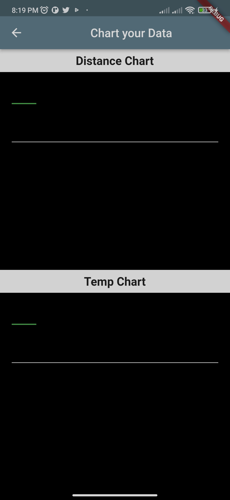
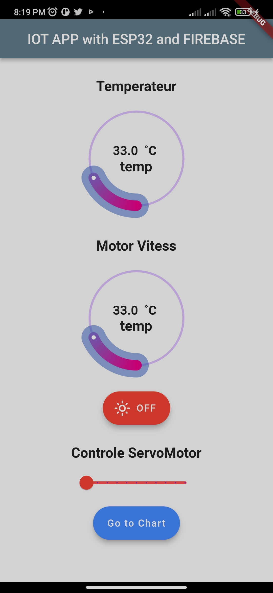
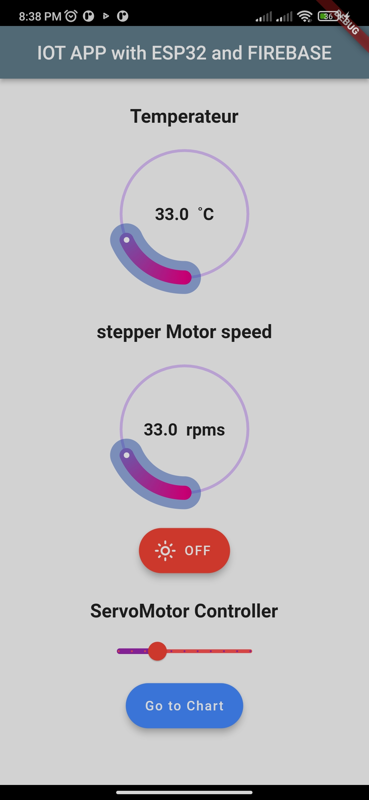

# Flutter App to display data from Sensor works with ESP32 and FIREBASE
this app helps you to display Data in your phone and control angle Servo Motors ,the app connected to Firebase RTD
you can display Temperature and speed of an steperMotor and also you can put data in Chart
## Chart Screen

## desplay and control screen


## Technologies used

This project uses Flutter. The reason I chose Flutter is that I am very comfortable with using the framework and that you only have to write once and can run anywhere.

## Contributing

Contributions are always welcome!
## To do
[] Radar Screen to display Ultrasonic data as a radar detector
[] UI upgrade 
Clone this project

```
  git clone https://github.com/misarb/esp32.git
```

CD into the project

```bash
  cd esp32/lib
```

Download dependencies 

```bash
  flutter pub get
```

Run the project

```bash
  flutter run
```
## Authors

- [@misarb](https://github.com/misarb)
